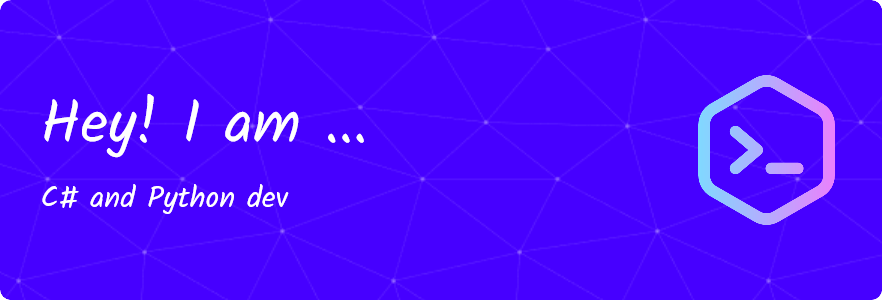

  <ul align="center" style="list-style: none">
    

      <h1>
        👋 Hi, my name is Bokobelin
      </h1>
    

  </ul>

**<h3 align="left">Connect with me:</h3>** 

 **<h3 align="left">🚀 Fan of C# and web dev, but also a bit of python.</h3>**

**<h3 align="left">Rapid Fire</h3>**

- 💼 I'm currently working on: **💻 Contributing to open-source**
- 💬 Ask me about: **💡 Python and C#**
- ⚡ Fun fact: **Sleeping helps me think about how to fix issues**

 **<h3 align="left">Skills</h3>**

       

 **<h3 align="left">GitHub Stats</h3>**

  
  

  

